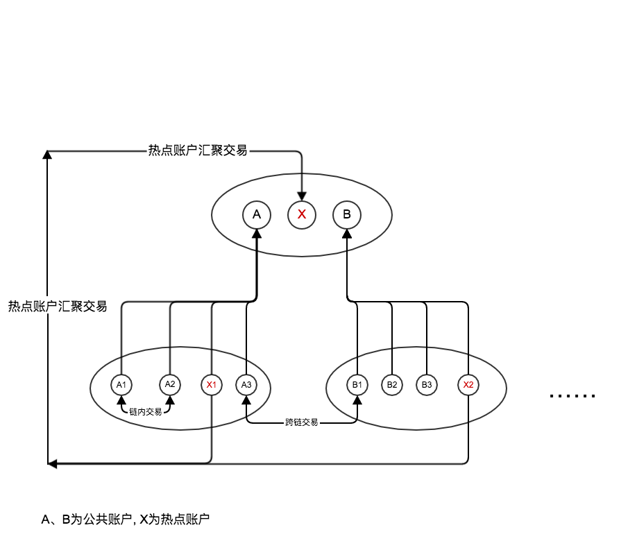

### 总览 Summary

### 账户模块 Account
账户类型分为  私有账户、热点账户、公共账户
- 私有账户：最普通账户，由用户手里的私钥控制，只存在于最底层的链中
- 热点账户：一般为机构账户（比如支付宝），它分布在各层的私有链中，主要用于**减少跨链交易**，下层的热点账户可直接向上层的热点账户转账（零钱收集操作）
- 公有账户：最底层链中的**跨链**交易的总账账户

### 账本模块 Ledger

### 网络模块 Net

### 共识模块 Consensus

### 权限管理 Accesscontrol

### 区块链  Blockchain
